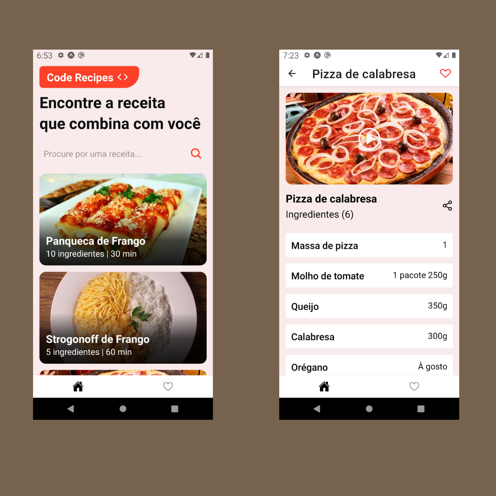
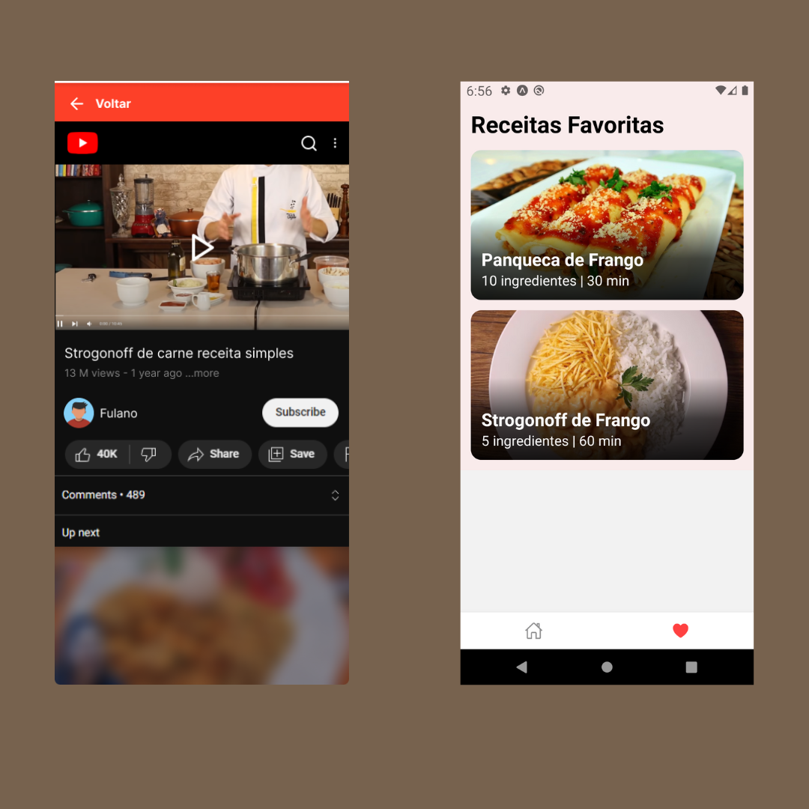
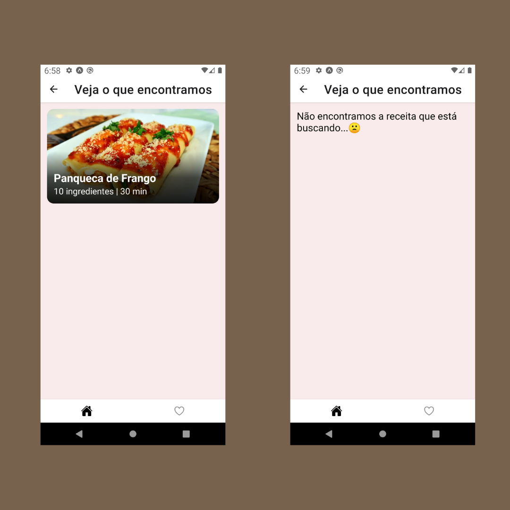

<h1 align="center" style="background: #FD4028; border-radius: 1rem"> Code Recipes <> </h1>

  <a href="#-projeto">Projeto</a>&nbsp;&nbsp;&nbsp;|&nbsp;&nbsp;&nbsp;
  <a href="#-tecnologias">Tecnologias</a>&nbsp;&nbsp;&nbsp;|&nbsp;&nbsp;&nbsp;
  <a href="#memo-licença">Licença</a>

  

## 💻 Projeto

O Code Recipes é um app para encontrar suas receitas favoritas.

 

  

  

  

## 🚀 Tecnologias

Esse projeto foi desenvolvido com as seguintes tecnologias:

- ReactNative
- JSON Server
- EXPO
- AXIOS
- MOTI
- Git e Github

## :memo: Licença

Esse projeto está sob a licença MIT.

---
